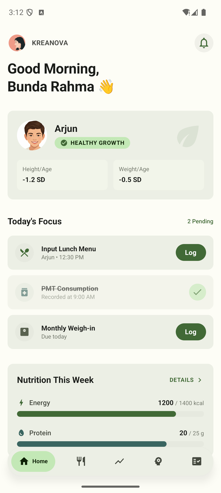
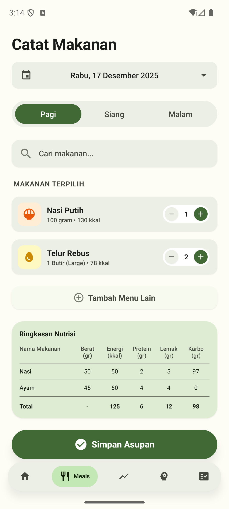
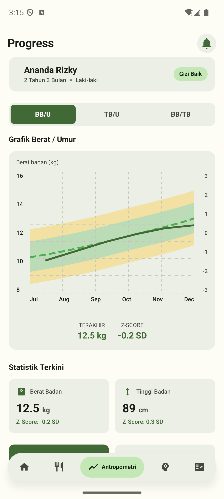
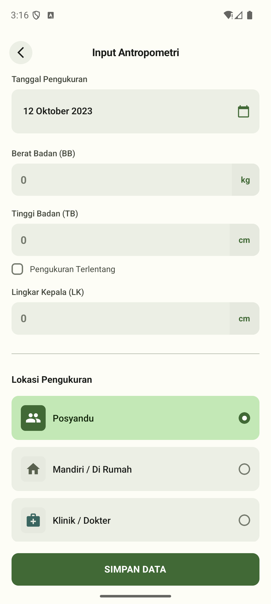
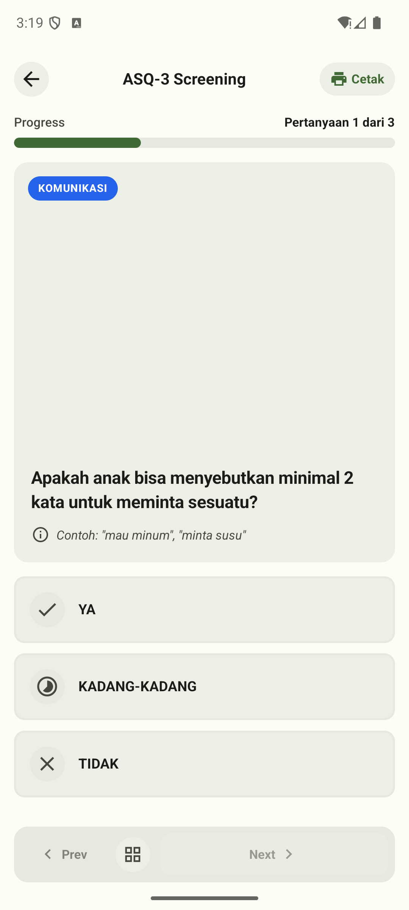
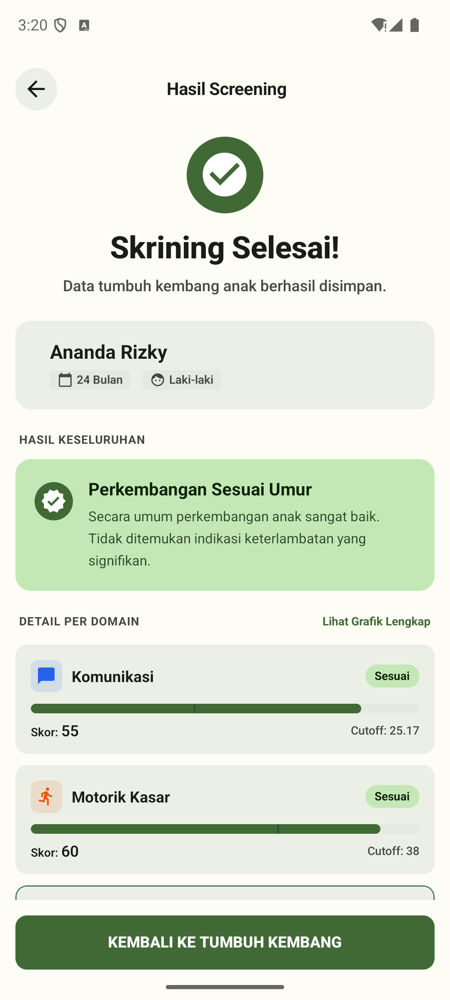
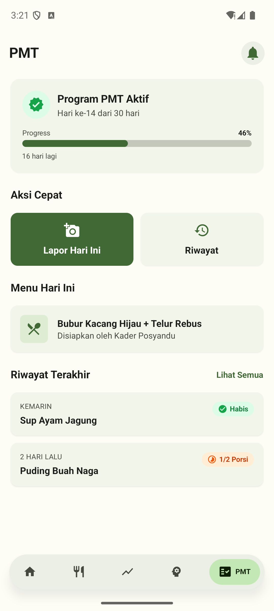
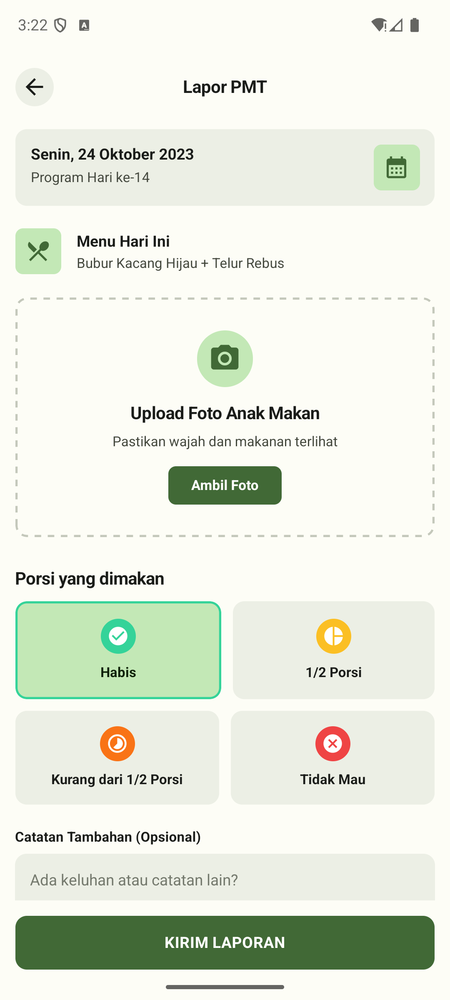
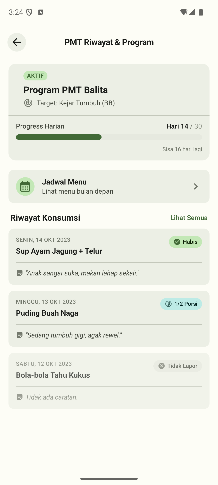

# KREANOVA Mobile App

A React Native mobile application built with Expo for tracking child nutrition, growth, developmental screening (ASQ-3), and PMT (Pemberian Makanan Tambahan) program management.

## Features

- **📊 Dashboard** - Overview of child's health status and pending tasks
- **🍽️ Food Input** - Log daily meals with Indonesian date picker and nutrition summary table
- **📈 Growth Tracking** - Record and monitor anthropometric measurements (height/weight)
- **🧠 ASQ-3 Screening** - Developmental screening questionnaire for children
- **🥗 PMT Tracking** - Track supplementary food program consumption

## Screenshots

### Main Screens

| Home | Food Input | Progress |
|:---:|:---:|:---:|
|  |  |  |

### Anthropometry

| Input | History |
|:---:|:---:|
|  |  |

### ASQ-3 Screening

| Index | Questionnaire | Result |
|:---:|:---:|:---:|
|  |  |  |

### PMT (Pemberian Makanan Tambahan)

| Index | Report | History |
|:---:|:---:|:---:|
|  |  |  |

## Tech Stack

- **Framework**: React Native with Expo SDK 54
- **Styling**: NativeWind (TailwindCSS for React Native)
- **Navigation**: Expo Router (file-based routing)
- **UI Components**: Custom components with Material Icons
- **Date Picker**: @react-native-community/datetimepicker

## Get Started

1. Install dependencies

   ```bash
   npm install
   ```

2. Start the app

   ```bash
   npx expo start
   ```

3. Open in development:
   - [Android emulator](https://docs.expo.dev/workflow/android-studio-emulator/)
   - [iOS simulator](https://docs.expo.dev/workflow/ios-simulator/)
   - [Expo Go](https://expo.dev/go)

## Project Structure

```
app/
├── (tabs)/            # Tab-based navigation screens
│   ├── index.tsx      # Dashboard/Home
│   ├── input.tsx      # Food input
│   ├── progress.tsx   # Growth progress
│   ├── screening.tsx  # ASQ-3 screening
│   └── pmt.tsx        # PMT tracking
├── anthropometry/     # Anthropometry screens
├── screening/         # ASQ-3 questionnaire & results
├── pmt/               # PMT report screens
├── profile/           # Parent/child profile management
└── auth/              # Authentication screens
```

## Learn More

- [Expo Documentation](https://docs.expo.dev/)
- [React Native](https://reactnative.dev/)
- [NativeWind](https://www.nativewind.dev/)
